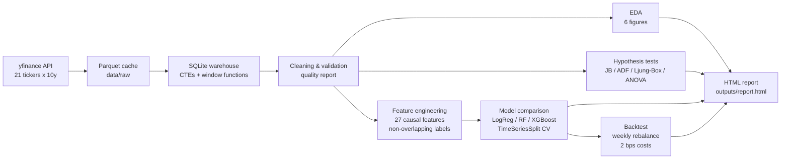

# Equity Quant ML

**S&P 500 Quantitative Market Analysis & Machine-Learning Trading Signals**

[](https://www.python.org)
[](LICENSE)
[](tests/)

An end-to-end quantitative research pipeline over **10+ years of daily data for
21 large-cap S&P 500 constituents (56,553 records, 8 GICS sectors)**: market
data ingestion, an SQLite analytical warehouse driven by window functions and
CTEs, rigorous data-quality validation, exploratory analysis, a formal
statistical hypothesis-testing suite, leakage-safe feature engineering,
next-week direction classification with time-series cross-validation, and an
out-of-sample backtest net of transaction costs — wrapped up in a
self-contained HTML research report.

> This is a research/educational project. It is **not** investment advice.

---

## Key results (real pipeline output, reproducible)

| Metric | Value |
|---|---|
| Universe | 21 S&P 500 stocks, 8 sectors + SPY benchmark |
| Data window | 2016-01-04 → 2026-09-18 (2,693 trading days) |
| Modelling sample | 11,067 non-overlapping weekly observations, 27 features |
| Best classifier (hold-out) | Random Forest — **ROC-AUC 0.530** vs 54.7% up-period base rate |
| Out-of-sample strategy Sharpe | **1.96** vs 1.28 for SPY buy-and-hold (2 bps costs) |
| Out-of-sample max drawdown | **-10.8%** vs -14.0% for SPY, at 79% average exposure |
| Fat-tail evidence | Jarque-Bera rejects normality for **21/21** tickers (excess kurtosis ≈ 15) |
| Sector heterogeneity | One-way ANOVA across sectors: F = 2.45, **p = 0.017** |

The honest headline: daily-direction predictability is essentially nil
(cross-validated AUC ≈ 0.50 — consistent with weak-form market efficiency),
but at the **weekly horizon** momentum/volatility features carry real signal,
and a selective probability-threshold policy converts that thin edge into
meaningfully better risk-adjusted performance. The methodology — not the
returns — is the product of this repository.

## Pipeline architecture



## Quickstart

```bash
# 1. Clone
git clone https://github.com/<your-username>/equity-quant-ml.git
cd equity-quant-ml

# 2. Environment (Python 3.10+)
python -m venv .venv && source .venv/bin/activate   # Windows: .venv\Scripts\activate
pip install -r requirements.txt

# 3. Run the full pipeline (~3-6 min; downloads ~22 tickers on first run)
python run_pipeline.py

# Useful variants
python run_pipeline.py --skip-download   # reuse the Parquet cache
python run_pipeline.py --stage eda       # run stages up to a given point
python -m pytest tests/ -v               # unit tests (leakage guards)
```

Outputs land in `outputs/`:

| Artefact | Description |
|---|---|
| `outputs/report.html` | Self-contained analysis report (figures embedded, ~1.2 MB) |
| `outputs/figures/*.png` | 11 publication-quality charts |
| `outputs/results.json` | Machine-readable summary of every stage |
| `database/market_data.db` | SQLite warehouse with the analytical tables |
| `data/raw/*.parquet` | Cached OHLCV bars per ticker |

## Methodology highlights

These are the design decisions an interviewer is most likely to probe —
each is implemented deliberately and covered by unit tests:

1. **No look-ahead bias.** Every feature at `(ticker, t)` uses only data
   available at the close of day `t`; the label is the direction of the
   forward 5-trading-day return. `tests/test_pipeline.py::TestNoLookAhead`
   proves that truncating the future leaves features at `t` bit-identical.
2. **Non-overlapping labels.** The modelling set keeps every 5th trading
   date, so consecutive weekly labels never overlap — otherwise
   cross-validation scores would be inflated by label autocorrelation.
3. **Time-series-aware validation.** `TimeSeriesSplit` folds inside the
   training period (never fitting on the future to predict the past); the
   final 20% of dates are an untouched chronological hold-out.
4. **Honest baselines.** Accuracy is reported against the majority-class
   (up-period) base rate; the backtest benchmark (SPY) is measured over
   identical rebalance windows, including transaction costs.
5. **Cost-aware backtesting.** 2 basis points are charged per unit of
   position turnover; exposure, turnover, hit rate and drawdown are all
   reported, not just the equity curve.
6. **SQL as a first-class citizen.** Rolling volatility, monthly returns
   and Sharpe-by-sector are computed in SQLite with window functions and
   CTEs (see `src/sql_layer.py`), mirroring a real warehouse workflow.

## Repository layout

```
equity-quant-ml/
├── run_pipeline.py            # one-command orchestration (9 stages)
├── config.yaml                # single source of truth for all parameters
├── src/
│   ├── data_acquisition.py    # yfinance download + Parquet cache + retries
│   ├── sql_layer.py           # SQLite DDL + analytical SQL catalogue
│   ├── data_cleaning.py       # rectangularisation, validation, outliers
│   ├── eda.py                 # 6 exploratory figures + summary stats
│   ├── statistical_tests.py   # JB / ADF / Ljung-Box / ANOVA suite
│   ├── feature_engineering.py # 27 causal features + forward-horizon label
│   ├── modeling.py            # 3 classifiers, TimeSeriesSplit CV, figures
│   ├── backtest.py            # weekly-rebalance backtest vs SPY
│   └── report_generator.py    # Jinja2 → self-contained HTML report
├── tests/
│   └── test_pipeline.py       # leakage guards + schema/target invariants
├── docs/
│   └── data_dictionary.md     # every raw & feature field documented
├── data/raw/                  # Parquet cache (created at runtime)
├── database/                  # SQLite warehouse (created at runtime)
└── outputs/                   # figures, results.json, report.html
```

## Statistical findings worth citing

- **Fat tails:** pooled daily returns show excess kurtosis ≈ 15 and
  Jarque-Bera rejects normality for all 21 tickers — Gaussian risk models
  materially understate tail risk.
- **Volatility clustering:** Ljung-Box on *squared* returns is highly
  significant (p < 1e-100) while linear return autocorrelation is weak —
  classic ARCH effects, which motivates the realised-volatility and
  Bollinger features.
- **Stationarity:** ADF rejects a unit root in returns but not in prices —
  the formal justification for modelling returns rather than price levels.
- **Sector heterogeneity:** ANOVA across sectors is significant
  (F = 2.45, p = 0.017), supporting the inclusion of sector dummies.

## Configuration

Everything is parameterised in `config.yaml`: the ticker universe and
sector map, the data window, feature parameters (RSI period, MACD spans,
Bollinger width, sampling step), model hyperparameters, and backtest
settings (threshold, costs, risk-free rate). No magic numbers in code.

## Limitations

- 21 large-cap tickers is a small universe; results may not generalise to
  small caps or other markets.
- Close-to-close labels ignore overnight gaps and execution slippage.
- The out-of-sample window (Aug 2024 → Sep 2026) was a strong bull market;
  the edge is regime-dependent and the CV period (2016–2024) shows
  cross-validated AUC ≈ 0.49, i.e. little exploitable signal there.
- No hyperparameter search, ensembling, regime features, or macro overlay.

## Data source & attribution

Daily OHLCV bars are downloaded via
[yfinance](https://github.com/ranaroussi/yfinance) from Yahoo Finance
(split- and dividend-adjusted, `auto_adjust=True`). Cached Parquet files are
for research convenience only.

## License

[MIT](LICENSE)
